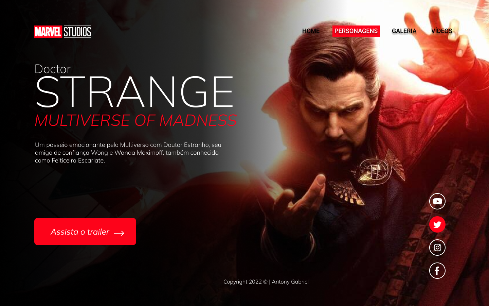
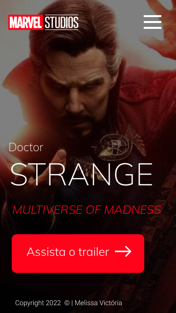

#  Doctor Strange

Projeto construído durantes as aulas de LIMA, no [SENAI Jandira](https://jandira.sp.senai.br/), com orientação do Professor [Fernando Leonid](href="https://github.com/fernandoleonid) 

 

 ---

## Qual era o objetivo do projeto? 
O objetivo era criar uma landing page com base no design feito no figma, aprendendo a estrutura do HTML, CSS, JS e conceitos de responsividade. 
 
 ---

## O que é uma Landing Page?
Landing Pages são páginas com foco principal na conversão de visitantes, assim, essas páginas possuem uma estética minimalista comparada com os sites tradicionais. 

---

## Tecnologias usadas
- HTML 5
- CSS 3
- JavaScript 
- Figma 

---

## Links 

- [Resultado](https://melissavic.github.io/strange-2022/)
-[Projeto no Figma](https://www.figma.com/file/b6NPLHCQV3SvSZs5xn3cdQ/Untitled?node-id=0%3A1)
-[Código](https://melissavic.github.io/strange-2022/)

---

## Autor 

Melissa Victória Lacerda Araújo 
 Estuadante Senai - Téncica em Desenvolvimento de Sistemas 